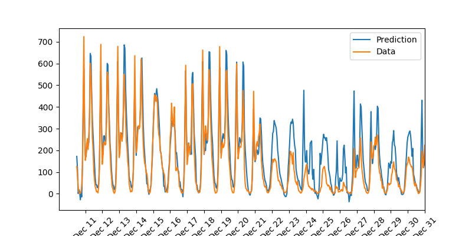
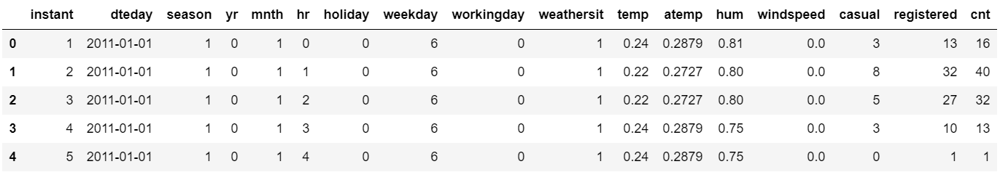
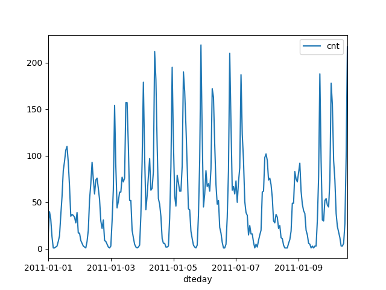
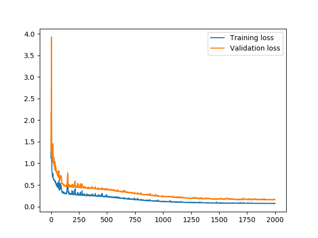

# Predict-Daily-Bike-Rental-Ridership

This is the first project in [Deep Learning Nanodegree](https://www.udacity.com/course/deep-learning-nanodegree--nd101) at Udacity. Codes including data cleaning, plotting, and training were provided by Udacity. 

In this project, I implemented 2 layer neural network. Approximately 730 days of the period was divided into training set, validation set, and test set in proportion of 30:3:1. Following plot shows the prediction of the bike rental from Dec 11 2012 to Dec 31 2012 from the trained neural network:

## Dataset

UCI - Bike Sharing Dataset Data Set 

This [dataset](https://archive.ics.uci.edu/ml/datasets/Bike+Sharing+Dataset) contains bike rental information from Jan 1 2011 to Dec 31 2012.

## Data Cleaning

Data Cleaning was done by Udacity

### Step 1: Overview of the dataset

Plotting first 10 days of the dataset.

### Step 2: Scaling target variables

To make training easier, standardize continuous variables.

### Step 3: Splitting the data into training, testing, and validation sets

Save the last 21 days (from Dec 11 2012 to Dec 31 2012) as test set. Then, holdout the last 60 days (excluding the test set) as the validation set.

## Neural Network Architecture

### Layers

- hidden layer: 10 hidden nodes
- output layer: 1 output node

### Activation function

- hidden layers: sigmoid function
- output layer: f(x) = x

The network is used for regression. Hence the output of the node is the same as the input of the node.

### Others

- Forward propagation: Calculate outputs for each neuron.
- Back propagation: Use pre-caluculated weights to propagate error backwards to update the weights.

## Training the network

Used Stochastic Gradient Descent (SGD) to train the network. Instead of using the whole batch to update the weights once, I randomly sampled the data, and updated weights per sample.

### Number of iterations

Chose 2000 iterations. To avoid the model from overfitting the training set, I trained the learning procedure until the loss on the validation set stops decreasing.

### Learning rate

I started with the learning rate of 1. For every 50 epochs, I reduced the learning rate by multiplying 0.99 to the previous learning rate. In this way, I can efficiently train the network (loss decrease steeply in the beginning and as epochs increase it converges to a local minimum).

### Number of hidden nodes

I chose 10 hidden nodes. When I experimented with smaller number of hidden nodes, the network failed to capture the complexity in the data set. However when large number of hidden nodes were used, the network overfit the training set. Hence, I chose 10 hidden nodes that captures the complexity in data, but not too much so as to prevent overfitting.

Following is the plot showing the training loss and validation loss of the trained network model:

## Result

Here's the prediction of the bike rental from Dec 11 2012 to Dec 31 2012. Blue line shows the predtiction of the bike rental whereas orange line depicts actual bike rentals during the period

## Conclusion

The model predicts the data pretty well. From Dec 11 to Dex 21 where actual `cnt` is high, the model precisely predict the `cnt`. However, from Dec 22 where the actual `cnt` is low, the models seems to fail to predict the `cnt`. 

I suppose the reason it fails is because the model fails to capture people's behavior in this period (Chrismas to New Year) compared to other days. People might be traveling in this holiday season. Since the data is from January 1 2011 to December 31 2012, this phenomenon is trained for only 2011 year term.
